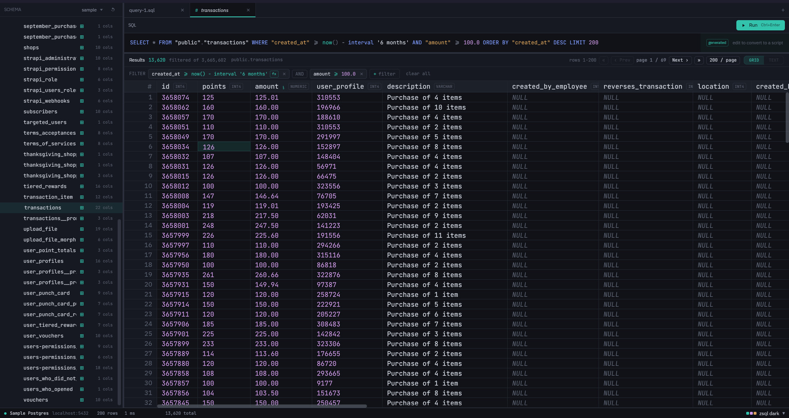
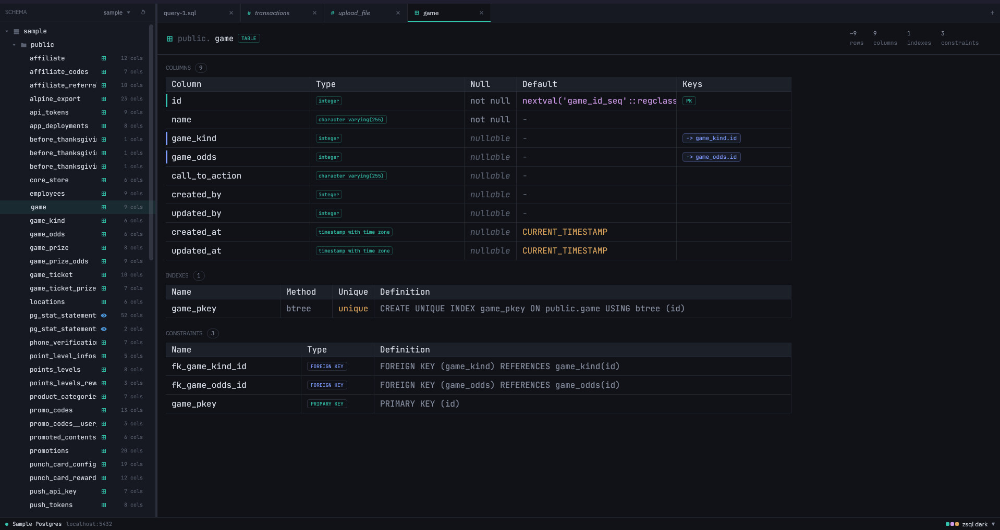

# ZSQL
A lightweight developer-first SQL editor.

## Screenshots

<details>
<summary>Basic Query Editor</summary>

<p align="center"></p>

</details>

<details>
<summary>Schema Explorer</summary>

<p align="center"></p>
</details>

## Features
- Lightweight - built with Zed's [gpui](https://docs.rs/gpui/latest/gpui/)
- Multi-database support
- Simple query generation (with filters, pagination, and sorting)
- Simple schema exploration (table & column metadata)
- Custom SQL scripts with syntax highlighting
- Detailed value viewer (JSON, hex, etc.)
- Multiple theme & custom theme support

## Database Support
- PostgreSQL
- MySQL
- SQLite
- Microsoft SQL Server

## Installing
For now, you must clone the repo and use cargo to install the binary:
```sh
cargo install --path crates/zsql
```

## Building
The core binary is in `crates/zsql`. To build it in release mode:
```sh
cargo build --release
```

## Toolchain
- Latest stable Rust. Verify with `rustc --version` / `cargo --version`.
- `rustfmt` and `clippy` components: `rustup component add rustfmt clippy`.

## Development
Just like building, the main binary can be run with cargo:
```sh
cargo run 
```

See the [CONVENTIONS.md](./CONVENTIONS.md) for general coding conventions and guidelines.

### Local Databases
There are scripts for spinning up local development databases using docker in `./scripts`. For 
example:
```sh
./scripts/pg-dev.sh up      # ephemeral Postgres in Docker + seed data
./scripts/pg-dev.sh down    # stop it
```

### Testing
There is extensive unit testing across all of the crates. To run all tests, excluding the tests
that require running databases, run:
```sh
cargo test --all
```

If you're working on a driver, or would like to run the full test suite, you'll need to enable
the `driver-integration-tests` feature. There is a convenience script for running the full test
suite, including the integration tests that require locally running databases.
```sh
# Keep in mind - you'll need docker to actually spin up the databases
./scripts/test-all.sh
```

### Formatting & Linting
The project uses `rustfmt` and `clippy` (pedantic) for formatting and linting. To run these checks,
you can run:
```sh
cargo fmt --all
cargo clippy --all-targets -- -D warnings
```
